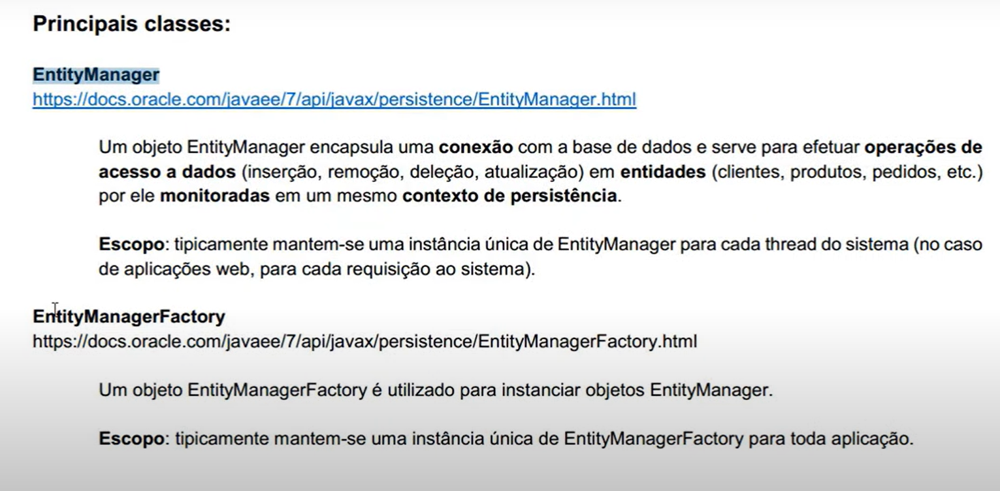
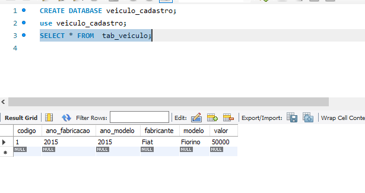
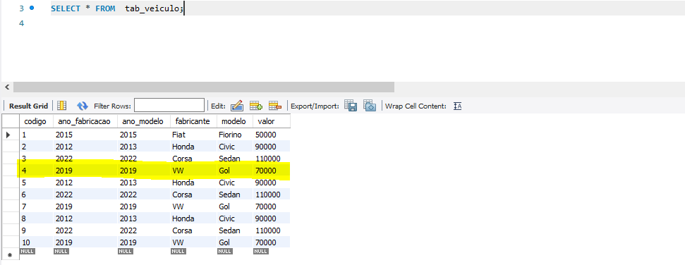
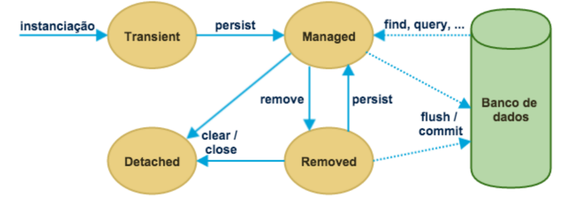
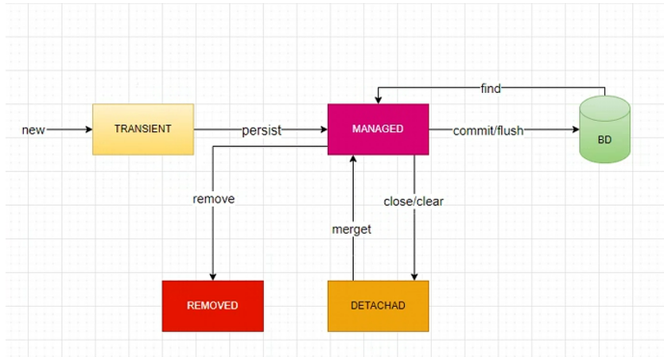

# teste-jpa

# jpa-e-hibernate

## Introdução

- O que é persistencia?
  Quando falamos de persistência de dados com Java, normalmente falamos do
  uso de sistemas gerenciadores de banco de dados relacionais e SQL, porém
  existem diversas outras alternativas para persistir dados, como em arquivos
  XML, arquivos texto e etc.

- Mapeamento Objeto Relacional (ORM)

Mapeamento objeto relacional (object-relational mapping, ORM, O/RM ou O/R
mapping) é uma técnica de programação para conversão de dados entre banco
de dados relacionais e linguagens de programação orientada a objetos.

Em banco de dados, entidades são representadas por tabelas, que possuem
colunas que armazenam propriedades de diversos tipos. Uma tabela pode se
associar com outras e criar relacionamentos diversos.

Em uma linguagem orientada a objetos, como Java, entidades são classes, e
objetos dessas classes representam elementos que existem no mundo real.

Em banco de dados, podemos ter as tabelas nota_fiscal e também imposto, mas
a estrutura de banco de dados relacional está longe de ser orientado a objetos, e
por isso a ORM foi inventada para suprir a necessidade que os desenvolvedores
têm de visualizar tudo como objetos para programarem com mais facilidade.

Podemos comparar o modelo relacional com o modelo orientado a objetos
conforme a tabela abaixo:

Uma solução ORM consiste de uma API para executar operações CRUD simples
em objetos de classes persistentes, uma linguagem ou API para especificar
queries que se referem a classes e propriedades de classes, facilidades para
especificar metadados de mapeamento e técnicas para interagir com objetos
transacionais para identificarem automaticamente alterações realizadas,
carregamento de associações por demanda e outras funções de otimização.

Em um ambiente ORM, as aplicações interagem com APIs e o modelo de classes
de domínio e os códigos SQL/JDBC são abstraídos. Os comandos SQL são
automaticamente gerados a partir dos metadados que relacionam objetos a banco
de dados.

ORM abstrai sua aplicação do banco de dados e do dialeto SQL. Com JPA,
você pode desenvolver um sistema usando um banco de dados e colocá-lo em
produção usando diversos outros bancos de dados, sem precisar alterar códigos-
fontes para adequar sintaxe de queries que só funcionam em SGBDs de
determinados fornecedores.

## Java Persistence API e Hibernate

A Java Persistence API (JPA) é um framework para persistência em Java, que
oferece uma API de mapeamento objeto-relacional e soluções para integrar
persistência com sistemas corporativos escaláveis.

Com JPA, os objetos são POJO (Plain Old Java Objects), ou seja, não é necessário
nada de especial para tornar os objetos persistentes. Basta adicionar algumas
anotações nas classes que representam as entidades do sistema e começar a
persistir ou consultar objetos.

JPA é uma especificação, e não um produto. Para trabalhar com JPA, precisamos
de uma implementação.

O projeto do Hibernate ORM possui alguns módulos, sendo que o Hibernate
EntityManager é a implementação da JPA que encapsula o Hibernate Core.

O Hibernate Core é a base para o funcionamento da persistência, com APIs
nativas e metadados de mapeamentos em arquivos XML, uma linguagem de
consultas chamada HQL (parecido com SQL), um conjunto de interfaces para
consultas usando critérios (Criteria API), etc.

## projeto

Em nosso projeto de exemplo, queremos gravar e consultar informações de
veículos de uma concessionária no banco de dados.

- Criar modelo de dominio para o negócio em questão

A classe Veiculo possui os seguintes atributos:
• codigo: identificador único do veículo
• fabricante: nome do fabricante do veículo
• modelo: descrição do modelo do veículo
• anoFabricacao: número do ano de fabricação do veículo
• anoModelo: número do ano do modelo do veículo
• valor: valor que está sendo pedido para venda do veículo

O atributo identificador (chamado de codigo) é referente à chave primária da
tabela de veículos no banco de dados. Se existirem duas instâncias de Veiculo
com o mesmo identificador, eles representam a mesma linha no banco de dados.

As classes persistentes devem seguir o estilo de JavaBeans, com métodos getters e
setters. É obrigatório que esta classe possua um construtor sem argumentos.

Como você pode ver, a classe persistente Veiculo é um POJO, o que significa que
podemos instanciá-la sem necessidade de containeres especiais.

- Implementação do equals() e hashCode()

Para que os objetos persistentes sejam diferenciados uns de outros, precisamos
implementar os métodos equals() e hashCode().

No banco de dados, as chaves primárias diferenciam registros distintos. Quando
mapeamos uma entidade de uma tabela, devemos criar os métodos equals()
e hashCode(), levando em consideração a forma em que os registros são
diferenciados no banco de dados.

O Eclipse possui um gerador desses métodos que usa uma propriedade (ou
várias, informadas por você) para criar o código-fonte. Veja como deve ficar a
implementação dos métodos para a entidade Veiculo.

Agora o Hibernate conseguirá comparar objetos para descobrir se são os mesmos.

Qual é a real importância dos métodos equals e hashCode?

Entender os motivos por trás destes métodos nas classes Java fazem muita diferença para criar um software sem bugs e 
com melhor performance, principalmente quando se trabalha com coleções como ArrayList e HashSet.

## Mapeamento básico

Para que o mapeamento objeto/relacional funcione, precisamos informar à
implementação do JPA mais informações sobre como a classe Veiculo deve se
tornar persistente, ou seja, como instâncias dessa classe podem ser gravadas
e consultadas no banco de dados. Para isso, devemos anotar os getters ou os
atributos, além da própria classe.

- @Id
- @Entity :diz que a classe é uma entidade, que representa uma tabela
  do banco de dados.
- @Table
- @GeneratedValue

As anotações @Id e @GeneratedValue são usadas para declarar o identificador do banco de dados, 
e esse identificador deve ter um valor gerado no momento de inserção (auto-incremento).

As anotações nos métodos getters configuram a relação dos atributos da classe
com as colunas do banco de dados.

Você deve ter percebido que as anotações foram importadas do pacote
javax.persistence. Dentro desse pacote estão todas as anotações padronizadas
pela JPA.

## O arquivo persistence.xml

O persistence.xml é um arquivo de configuração padrão da JPA. Ele deve ser
criado no diretório resources na pasta META-INF da aplicação ou do módulo que contém os beans
de entidade.

O arquivo persistence.xml define unidades de persistência, conhecidas como
persistence units.

<?xml version="1.0" encoding="UTF-8"?>
<persistence version="2.2"
xmlns="http://xmlns.jcp.org/xml/ns/persistence"
xmlns:xsi="http://www.w3.org/2001/XMLSchema-instance"
xsi:schemaLocation="http://xmlns.jcp.org/xml/ns/persistence http://xmlns.jcp.org/xml/ns/persistence/persistence_2_2.xsd">

    <persistence-unit name="veiculo_cadastro" >
        <provider>org.hibernate.ejb.HibernatePersistence</provider>

    <properties>
            <property name="javax.persistence.jdbc.driver" value="com.mysql.cj.jdbc.Driver"/>
            <property name="javax.persistence.jdbc.url" value="jdbc:mysql://localhost:3306/veiculo_cadastro?serverTimezone=UTC"/>
            <property name="javax.persistence.jdbc.user" value="root"/>
            <property name="javax.persistence.jdbc.password" value="123456"/>

            <property name="hibernate.dialect" value="org.hibernate.dialect.MySQL8Dialect"/>
            <property name="hibernate.show_sql" value="true"/>
            <property name="hibernate.hbm2ddl.auto" value="update"/>
            <property name="hibernate.format_sql" value="true" />
        </properties>
    </persistence-unit>

</persistence>

O nome da unidade de persistência foi definido como "jpa". Precisaremos
desse nome daqui a pouco, quando formos colocar tudo para funcionar.

O provider diz qual é a implementação que será usada como provedor de
persistência.

Existem várias opções de configuração que podem ser informadas neste arquivo
XML. Vejamos as principais propriedades que usamos em nosso arquivo de
configuração:

• javax.persistence.jdbc.url: descrição da URL de conexão com o banco de dados
• javax.persistence.jdbc.driver: nome completo da classe do driver JDBC
• javax.persistence.jdbc.user: nome do usuário do banco de dados
• javax.persistence.jdbc.password: senha do usuário do banco de dados
• hibernate.dialect: dialeto a ser usado na construção de comandos SQL
• hibernate.show_sql: informa se os comandos SQL devem ser exibidos na console (importante para debug, mas deve ser 
desabilitado em ambiente de produção)
• hibernate.format_sql: indica se os comandos SQL exibidos na console devem ser formatados (facilita a compreensão, 
mas pode gerar textos longos na saída)
• hibernate.hbm2ddl.auto: cria ou atualiza automaticamente a estrutura das tabelas no banco de dados

## 2.6. Gerando as tabelas do banco de dados

Como ainda não temos a tabela representada pela classe Veiculo no banco de
dados, precisamos criá-la.
O Hibernate pode fazer isso pra gente, graças à propriedade
hibernate.hbm2ddl.auto com valor update, que incluímos no arquivo
persistence.xml.

Precisamos apenas criar um EntityManagerFactory, que todas as tabelas
mapeadas pelas entidades serão criadas ou atualizadas.

public class CriarTabelas {
public static void main(String[] args) {

        Persistence.createEntityManagerFactory("jpa");
    }
}

O parâmetro do método createEntityManagerFactory deve ser o mesmo nome
que informamos no atributo name da tag persistence-unit, no arquivo
persistence.xml.

Ao executar o código, a tabela Veiculo é criada.

## @TO-DO-LIST 

Rever essa parte

https://blog.algaworks.com/entendendo-o-equals-e-hashcode/?utm_source=ebook-pdf&utm_content=ebkjpa1ed-tip-equals-hashcode&utm_medium=link&utm_campaign=ebkjpa1ed

## Criando EntityManager

Os sistemas que usam JPA precisam de apenas uma instância de
EntityManagerFactory, que pode ser criada durante a inicialização da aplicação.
Esta única instância pode ser usada por qualquer código que queira obter um
EntityManager.

Um EntityManager é responsável por gerenciar entidades no contexto de
persistência . Através dos métodos dessa interface, é possível persistir, pesquisar e excluir objetos do banco de dados.

A inicialização de EntityManagerFactory pode demorar alguns segundos, por isso
a instância dessa interface deve ser compartilhada na aplicação.

Precisaremos de um lugar para colocar a instância compartilhada de
EntityManagerFactory, onde qualquer código tenha acesso fácil e rápido.
Criaremos a classe JpaUtil para armazenar a instância em uma variável estática.

Criamos um bloco estático para inicializar a fábrica de Entity Manager que está no arquivo "JPAUtil". Isso
ocorrerá apenas uma vez, no carregamento da classe. Agora, sempre que
precisarmos de uma EntityManager, podemos chamar:

EntityManager manager = JpaUtil.getEntityManager();

## Agora, vamos analisar as alterações que fizemos individualmente.

@Table(name = "tab_veiculo")
public class Veiculo {
Especificamos o nome da tabela como tab_veiculo. Se não fizermos isso, o nome
da tabela será considerado o mesmo nome da classe.

@Column(length = 60, nullable = false)
public String getFabricante() {
Definimos o tamanho da coluna com 60 e com restrição not null.

@Column(name = "ano_fabricacao", nullable = false)
public Integer getAnoFabricacao() {
Especificamos o nome da coluna como ano_fabricacao e com restrição not null. Se
o nome da coluna não for especificado, por padrão, ela receberá o mesmo nome
do atributo mapeado.

@Column(precision = 10, scale = 2, nullable = true)
public Double getValor() {
Atribuímos a precisão de 10 com escala de 2 casas na coluna de número decimal,
especificando, ainda, que ela pode receber valores nulos.

## Persistindo objetos

Chegou a hora de persistir objetos, ou seja, inserir registros no banco de dados.

classe pacote-> com.treinamento.prinicpal.Teste.class

      //persistir objetos(inserir registros no Bancod e dados)
        Veiculo veiculo= new Veiculo("Fiat","Fiorino",2015,2015,50000.00);

        manager.persist(veiculo);

Hibernate:
insert
into
tab_veiculo
(ano_fabricacao, ano_modelo, fabricante, modelo, valor)
values
(?, ?, ?, ?, ?)

O Hibernate gerou o SQL de inserção e nos mostrou na saída, pois configuramos
isso no arquivo persistence.xml.

Verificar na tabela os dados inseridos
SELECT * FROM  tab_veiculo;

Agora vamos entender o que cada linha significa.

- O código abaixo obtém um EntityManager da classe JpaUtil.

EntityManager manager = JpaUtil.getEntityManager();

- Agora iniciamos uma nova transação.

EntityTransaction tx = manager.getTransaction();
tx.begin();

- Instanciamos um novo veículo e atribuímos alguns valores, chamando os
métodos setters.

Veiculo veiculo= new Veiculo("Fiat","Fiorino",2015,2015,50000.00);

- Executamos o método persist, passando o veículo como parâmetro. Isso fará
com que o JPA insira o objeto no banco de dados. Não informamos o código
do veículo, porque ele será obtido automaticamente através do auto-increment do
MySQL.

manager.persist(veiculo);

- Agora fazemos commit da transação, para efetivar a inserção do veículo no banco
de dados.

tx.commit();

- Finalmente, fechamos o EntityManager e o EntityManagerFactory.

manager.close();
JpaUtil.close();

## Buscando objetos pelo identificador

Podemos recuperar objetos através do identificador (chave primária) da entidade.

public static void main(String[] args) {

        EntityManager manager= JPAUtil.getEntityManager();

        Veiculo veiculo=manager.find(Veiculo.class, 1L);

        System.out.println("Veiculo de Código "+ veiculo.getCodigo()+" é um "+veiculo.getModelo()+" ano fabricação "+veiculo.getAnoFabricacao());

        manager.close();
        JPAUtil.close();

    }
}

O resultado na console é o seguinte:

Hibernate:
  select
      veiculo0_.codigo as codigo1_0_0_,
      veiculo0_.ano_fabricacao as ano_fabr2_0_0_,
      veiculo0_.ano_modelo as ano_mode3_0_0_,
      veiculo0_.fabricante as fabrican4_0_0_,
      veiculo0_.modelo as modelo5_0_0_,
      veiculo0_.valor as valor6_0_0_
from
      tab_veiculo veiculo0_
where
      veiculo0_.codigo=?

Veiculo de Código 1 é um Fiorino ano fabricação 2015

Veja que o SQL gerado possui a cláusula where, para filtrar apenas o veículo de
código igual a 1.

Podemos também buscar um objeto pelo identificador usando o método
getReference.

public class BuscandoVeiculo2 {
public static void main(String[] args) {

        EntityManager manager= JPAUtil.getEntityManager();

        Veiculo veiculo= manager.getReference(Veiculo.class,1L);
        System.out.println("Veiculo de Código "+veiculo.getCodigo()+" é um "+veiculo.getModelo());

        manager.close();
        JPAUtil.close();

    }
}

O resultado na console é o seguinte:

Hibernate:
select
      veiculo0_.codigo as codigo1_0_0_,
      veiculo0_.ano_fabricacao as ano_fabr2_0_0_,
      veiculo0_.ano_modelo as ano_mode3_0_0_,
      veiculo0_.fabricante as fabrican4_0_0_,
      veiculo0_.modelo as modelo5_0_0_,
      veiculo0_.valor as valor6_0_0_
from
      tab_veiculo veiculo0_
where
      veiculo0_.codigo=?

Veiculo de Código 1 é um Fiorino

O resultado na console é o mesmo, deixando a impressão que os métodos find
e getReference fazem a mesma coisa, mas na verdade, esses métodos possuem
comportamentos um pouco diferentes.
O método find busca o objeto imediatamente no banco de dados, enquanto
getReference só executa o SQL quando o primeiro método getter for chamado,
desde que não seja o getCodigo.

public class BuscandoVeiculo3 {
public static void main(String[] args) {

        EntityManager manager= JPAUtil.getEntityManager();

        Veiculo veiculo= manager.getReference(Veiculo.class,1L);
        System.out.println("Buscou veículo. Será que executou o SELET?");
        System.out.println("Veiculo de código "+veiculo.getCodigo()+" é um "+veiculo.getModelo());

        manager.close();
        JPAUtil.close();

    }
}

Hibernate:
select
    veiculo0_.codigo as codigo1_0_0_,
    veiculo0_.ano_fabricacao as ano_fabr2_0_0_,
    veiculo0_.ano_modelo as ano_mode3_0_0_,
    veiculo0_.fabricante as fabrican4_0_0_,
    veiculo0_.modelo as modelo5_0_0_,
    veiculo0_.valor as valor6_0_0_
from
    tab_veiculo veiculo0_
where
    veiculo0_.codigo=?
Veiculo de código 1 é um Fiorino

Note que o SQL foi executado apenas quando um getter foi invocado, e não na
chamada de getReference.

## Listando objetos

Fazer consultas simples de entidades com a linguagem JPQL (Java Persistence Query Language). usaremos o básico para
conseguirmos consultar no banco de dados.

A JPQL é uma extensão da SQL, porém com características da orientação a
objetos. Com essa linguagem, não referenciamos tabelas do banco de dados, mas
apenas entidades de nosso modelo, que foram mapeadas para tabelas.

Quando fazemos pesquisas em objetos, não precisamos selecionar as colunas do
banco de dados, como é o caso da SQL. O código em SQL a seguir:

select * from veiculo

Fica da seguinte forma em JPQL:

from Veiculo

A sintaxe acima em JPQL significa que queremos buscar os objetos persistentes
da classe Veiculo.
public class ListandoVeiculos {
public static void main(String[] args) {

        EntityManager manager= JPAUtil.getEntityManager();

        Query query = manager.createQuery("from Veiculo");
        List<Veiculo>veiculos=query.getResultList();

        for (Veiculo veiculo:veiculos
             ) {
            System.out.println(veiculo.getCodigo()+"-"
            +veiculo.getFabricante()+", ano"
            + veiculo.getAnoFabricacao()+"/"
            + veiculo.getAnoModelo()+" por "
            +"R$"+ veiculo.getValor());

        }

        manager.close();
        JPAUtil.close();

    }
}

O resultado na console foi o seguinte:
Hibernate:
select
        veiculo0_.codigo as codigo1_0_,
        veiculo0_.ano_fabricacao as ano_fabr2_0_,
        veiculo0_.ano_modelo as ano_mode3_0_,
        veiculo0_.fabricante as fabrican4_0_,
        veiculo0_.modelo as modelo5_0_,
        veiculo0_.valor as valor6_0_
from
tab_veiculo veiculo0_
1-Fiat, ano2015/2015 por R$50000.0
2-Honda, ano2012/2013 por R$90000.0
3-Corsa , ano2022/2022 por R$110000.0
4-VW, ano2019/2019 por R$70000.0
5-Honda, ano2012/2013 por R$90000.0
6-Corsa , ano2022/2022 por R$110000.0
7-VW, ano2019/2019 por R$70000.0
8-Honda, ano2012/2013 por R$90000.0
9-Corsa , ano2022/2022 por R$110000.0
10-VW, ano2019/2019 por R$70000.0

A consulta SQL foi gerada baseada nas informações do mapeamento, e todos os
veículos da tabela foram listados.

A única novidade no código-fonte que usamos são as seguintes linhas:

Query query = manager.createQuery("from Veiculo");
List<Veiculo> veiculos = query.getResultList();

Veja que criamos uma query com a JPQL e armazenamos em uma variável query.
Depois, executamos o método getResultList desse objeto e obtemos uma lista de
veículos.

## Atualizando objetos

Os atributos de entidades podem ser manipulados através dos métodos setters,
e todas as alterações serão detectadas e persistidas automaticamente, quando o
contexto de persistência for descarregado para o banco de dados.

VERIFICAR FABIO

## Excluindo objetos

A exclusão de objetos é feita chamando o método remove de EntityManager,
passando como parâmetro o objeto.

public class ExcluindoVeiculo {
public static void main(String[] args) {

        EntityManager manager= JPAUtil.getEntityManager();
        EntityTransaction txs= manager.getTransaction();
        txs.begin();

        Veiculo veiculo=manager.find(Veiculo.class,1L);

        manager.remove(veiculo);

        txs.commit();
        manager.close();
        JPAUtil.close();

    }
}

No console:

Hibernate:
select
        veiculo0_.codigo as codigo1_0_0_,
        veiculo0_.ano_fabricacao as ano_fabr2_0_0_,
        veiculo0_.ano_modelo as ano_mode3_0_0_,
        veiculo0_.fabricante as fabrican4_0_0_,
        veiculo0_.modelo as modelo5_0_0_,
        veiculo0_.valor as valor6_0_0_
from
        tab_veiculo veiculo0_
where
veiculo0_.codigo=?
Hibernate:
delete
from
        tab_veiculo
where
codigo=?

## Gerenciando Estados

- Estados e ciclo de vida

Objetos de entidades são instâncias de classes mapeadas usando JPA, que ficam
na memória e representam registros do banco de dados. Essas instâncias
possuem um ciclo de vida, que é gerenciado pelo JPA.

Os estados do ciclo de vida das entidades são: transient (ou new), managed,
detached e removed.

As transições entre os estados são feitas através de métodos do EntityManager.

- Objetos transientes

Objetos transientes (transient) são instanciados usando o operador new. Isso
significa que eles ainda não estão associados com um registro na tabela do banco
de dados, e podem ser perdidos e coletados pelo garbage collector quando não
estiver mais sendo usado.

- Objetos gerenciados

Objetos gerenciados (managed) são instâncias de entidades que possuem um
identificador e representam um registro da tabela do banco de dados.

As instâncias gerenciadas podem ser objetos que foram persistidos através da
chamada de um método do EntityManager, como por exemplo o persist. Eles
também podem ter se tornado gerenciados através de métodos de consulta do
EntityManager, que buscam registros da base de dados e instanciam objetos
diretamente no estado managed.

Objetos gerenciados estão sempre associados a um contexto de persistência,
portanto, quaisquer alterações nesses objetos são sincronizadas com o banco de
dados.

- Objetos removidos

Uma instância de uma entidade pode ser excluída através do método remove do
EntityManager.

Um objeto entra no estado removed quando ele é marcado para ser eliminado, mas
é fisicamente excluído durante a sincronização com o banco de dados.

- Objetos desanexados

Um objeto sempre inicia no estado transiente e depois pode se tornar gerenciado.
Quando o Entity Manager é fechado, continua existindo uma instância do objeto,
mas já no estado detached.

Esse estado existe para quando os objetos estão desconectados, não tendo mais
sincronia com o banco de dados. A JPA fornece operações para reconectar esses
objetos a um novo EntityManager.

## Contexto de persistência

O contexto de persistência é uma coleção de objetos gerenciados por um
EntityManager.

Se uma entidade é pesquisada, mas ela já existe no contexto de persistência,
o objeto existente é retornado, sem acessar o banco de dados. Esse recurso é
chamado de cache de primeiro nível.

Uma mesma entidade pode ser representada por diferentes objetos na memória,
desde que seja em diferentes instâncias de EntityManagers. Em uma única
instância de EntityManager, apenas um objeto que representa determinada
entidade (com o mesmo identificador) pode ser gerenciada.

EntityManager manager = JpaUtil.getEntityManager();

Veiculo veiculo1 = manager.find(Veiculo.class, 2L);
System.out.println("Buscou veiculo pela primeira vez...");

Veiculo veiculo2 = manager.find(Veiculo.class, 2L);
System.out.println("Buscou veiculo pela segunda vez...");

System.out.println("Mesmo veículo? " + (veiculo1 == veiculo2));

manager.close();
JpaUtil.close();

O código acima busca o mesmo veículo duas vezes, dentro do mesmo contexto
de persistência. A consulta SQL foi executada apenas na primeira vez, pois na
segunda, o objeto já estava no cache de primeiro nível. Veja a saída:

Hibernate:
    select
        veiculo0_.codigo as codigo1_0_0_,
        veiculo0_.ano_fabricacao as ano_fabr2_0_0_,
        veiculo0_.ano_modelo as ano_mode3_0_0_,
        veiculo0_.fabricante as fabrican4_0_0_,
        veiculo0_.modelo as modelo5_0_0_,
        veiculo0_.valor as valor6_0_0_
    from
        tab_veiculo veiculo0_
    where
        veiculo0_.codigo=?
Buscou veiculo pela primeira vez...
Buscou veiculo pela segunda vez...
Mesmo veículo? true

O método contains de EntityManager verifica se o objeto está sendo gerenciado
pelo contexto de persistência do EntityManager. O método detach pára de
gerenciar a entidade no contexto de persistência, colocando ela no estado
detached.

        EntityManager manager = JPAUtil.getEntityManager();

        Veiculo veiculo1 = manager.find(Veiculo.class, 2L);
        System.out.println("Buscou veiculo pela primeira vez...");

        System.out.println("Gerenciado? " + manager.contains(veiculo1));
        manager.detach(veiculo1);
        System.out.println("E agora? " + manager.contains(veiculo1));

        Veiculo veiculo2 = manager.find(Veiculo.class, 2L);
        System.out.println("Buscou veiculo pela segunda vez...");

        System.out.println("Mesmo veículo? " + (veiculo1 == veiculo2));

        manager.close();
        JPAUtil.close();

Veja que agora a consulta foi executada duas vezes, pois desanexamos o veículo
que estava sendo gerenciado pelo contexto de persistência.

## Sincronização de dados

Os estados de entidades são sincronizados com o banco de dados quando ocorre
o commit da transação associada.

Podemos forçar a sincronização antes mesmo do commit, chamando o método
flush de EntityManager.

## Salvando objetos desanexados com merge()

Objetos desanexados são objetos em um estado que não é gerenciado pelo
EntityManager, mas ainda representa uma entidade no banco de dados. As
alterações em objetos desanexados não são sincronizadas com o banco de dados.

Quando estamos desenvolvendo sistemas, existem diversos momentos que
somos obrigados a trabalhar com objetos desanexados, por exemplo, quando eles
são expostos para alteração através de páginas web e apenas em um segundo
momento o usuário solicita a gravação das alterações do objeto.

No código abaixo, alteramos o valor de um veículo em um momento que o objeto
está no estado detached, por isso, a modificação não é sincronizada.

Podemos reanexar objetos em qualquer EntityManager usando o método merge.

public class ObjetosDesanexadosDetach {
public static void main(String[] args) {

        EntityManager manager= JPAUtil.getEntityManager();
        EntityTransaction tx= manager.getTransaction();
        tx.begin();//inicia uma transação com o BD

        Veiculo veiculo=manager.find(Veiculo.class,2L);

        tx.commit();
        manager.close();

        veiculo.setValor(99.00);

        manager=JPAUtil.getEntityManager();
        tx= manager.getTransaction();
        tx.begin();

        // reanexamos o objeto ao novo EntityManager
        veiculo = manager.merge(veiculo);

        tx.commit();
        manager.close();
        JPAUtil.close();

    }
}

O conteúdo do objeto desanexado é copiado para um objeto gerenciado com a
mesma identidade. Se o EntityManager ainda não estiver gerenciando um objeto
com a mesma identidade, será realizada uma consulta para encontrá-lo, ou ainda,
será persistida uma nova entidade.
O retorno do método merge é uma instância de um objeto gerenciado. O objeto
desanexado não muda de estado, ou seja, continua detached.

## Mapeamento

- Identificadores
  A propriedade de identificação representa a chave primária de uma tabela do
  banco de dados. Nos exemplos anteriores, a propriedade codigo de instâncias de
  veículos representava o código do veículo (chave primária) no banco de dados.

O identificador é mapeado para a chave primária codigo. Podemos alterar o nome
da coluna usando @Column.

@Id
@GeneratedValue(strategy = GenerationType.AUTO)
private Long codigo;

A anotação @Id no atributo marca a propriedade como um identificador,
e a anotação @GeneratedValue diz que o valor do identificador será gerado
automaticamente usando uma estratégia nativa do banco de dados, que no caso
do MySQL, é o auto-incremento.

Este último mapeamento poderia ser modificado para a seguinte forma (e o
significado seria o mesmo):

A única mudança realizada foi a inclusão da propriedade strategy na anotação
@GeneratedValue. Quando essa propriedade não é informada, é considerada a
estratégia AUTO como padrão.

Existe um gerador de chave próprio do Hibernate chamado increment, que é
o famoso select max + 1. Para usá-lo, incluímos a anotação @GenericGenerator
e informamos a propriedade strategy igual a increment, damos um nome a
esse gerador informando o atributo name e depois associamos esse gerador na
anotação @GeneratedValue, informando na propriedade generator o mesmo nome
escolhido para o gerador.

@Id
@GeneratedValue(generator = "inc")
@GenericGenerator(name = "inc", strategy = "increment")
@Column(name = "cod_veiculo")
private Long codigo;

Apartir de agora, antes de fazer um insert de veículo, o framework executará
um comando select para buscar o último identificador usado, e então fará um
incremento para utilizar como próximo código. Veja a query gerada quando
persistimos um novo veículo:

Hibernate:
        select
              max(cod_veiculo)
        from
              tab_veiculo
Hibernate:
insert
into
            tab_veiculo
            (ano_fabricacao, ano_modelo, fabricante, modelo, valor, cod_veiculo)
values
            (?, ?, ?, ?, ?, ?)

Esses são os identificadores mais usados. Consulte a documentação caso precise
de outro tipo de gerador. Se mesmo assim não encontrar um que atenda suas
necessidades, você poderá desenvolver o seu próprio gerador customizado.

## Chaves Compostas

Para exemplificar o uso de chaves compostas, incluiremos os atributos cidade
e placa como identificador de Veiculo. O atributo codigo não será mais o
identificador, por isso precisaremos eliminá-lo.

## Referencias

-https://blog.algaworks.com/entendendo-o-equals-e-hashcode/?utm_source=ebook-pdf&utm_content=ebkjpa1ed-tip-equals-hashcode&utm_medium=link&utm_campaign=ebkjpa1ed
